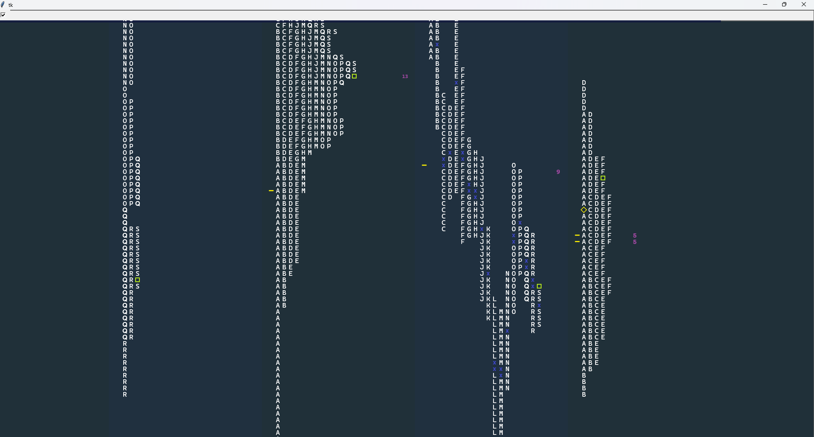
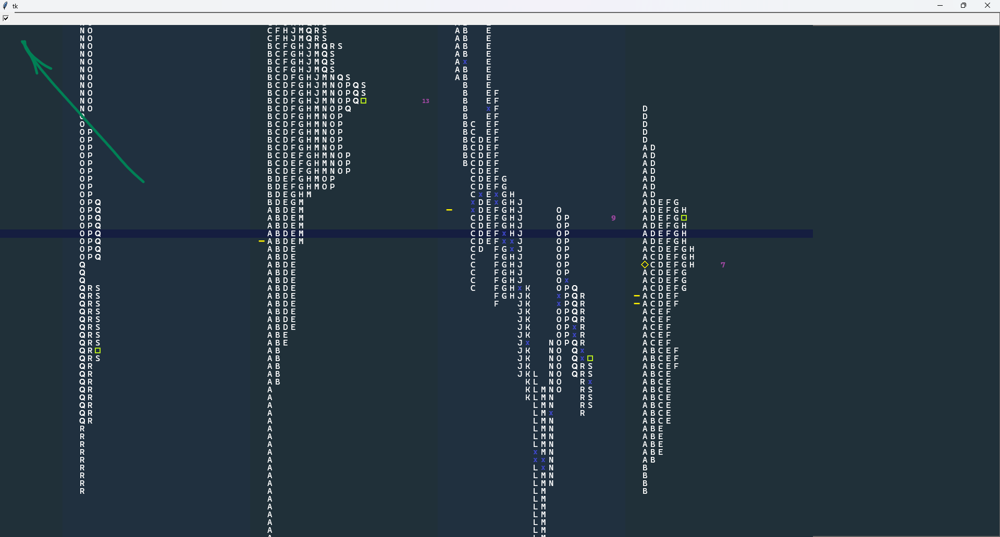

The project is based on 
[Yegor Bugayenko](https://www.youtube.com/@yegor256) 
elegant objects concepts. I tried to take them into account and tune my 
[original](https://github.com/mishagreh/mp_moex_gazp) 
approach, which is kind of naive, basically.  

In the first place it has to do with separate objects. 
The more objects the better, in comparison with functions. 
The smaller the objects the better, because it's easier to handle them.
The objects have to be 
encapsulated as much as possible, meaning there are less public attributes, less 
public methods, no static methods, the objects are immutable. 
I managed to achieve it for the majority of cases within the code, except
some classes working with GUI and database, when there are side effects.

Have a look on both implementations and compare.

<h1> Market profile analysis terminal. </h1>

<h2>>>> Disclaimer <<<</h2>   

The project is for educational (learning Python) purposes only, not intended and shall not be  
understood as financial advice and/or any kind of basis when making decisions on the financial markets.

<h2> Architecture</h2>  

Moscow Exchange ([MOEX](https://www.moex.com/en)) public [API](https://iss.moex.com/iss/reference/)
requests with the only GAZP (Gazprom) stock market security.

As long as the API is free of charge there is 15 minutes delay
when getting market data. In order to receive live data for the current working day
you need to start sending the requests no earlier than 10:46 (Moscow time).
Find check button in the left upper corner of the app window.

But the history profiles can be downloaded and will be laid out in GUI
regardless of this limitation. Right after midnight the app is able to
automatically download the entire history up to the previous day, 
if it's not downloaded and not saved on the hard-disk so far. 

The API responses are handled appropriately to build a string representation 
of daily market profiles, store them in SQLite database and build their 
image representation (stored on the hard-disk). 

After that the profile images are laid out in GUI with appropriate
positioning.

The same algorithm with minor differences is applied to the current day profile.

API request duration hardcoded as 60 seconds. The number of days for 
history is a configurable parameter (look it up in config.py, default is 5).
  
  

<h2> Quick start </h2>

Run ***pre_start.py*** first.  
It'll create directories for profile images 
and database on the disk C:, create the database itself with appropriate tables and 
set the history start date as the very first database record (which is
10 days ago from the date you run the pre_start file).  

Then run ***mp.py*** file.

<h2> Language </h2>

*Python 3.11*

<h2> Database </h2>

*SQLite3*

<h2> GUI </h2>

*Tkinter*

<h2> Operating system </h2>

Microsoft Windows 11

*(!) no any other OS adjustments*

<h2> Screen resolution </h2>

1920 * 1080  

*(!) no any other resolutions adjustments*

<h2> Bells and whistles </h2>

* Profiles history layout.  
* Current day profile layout.  
* Canvas drag'n'drop (left mouse button clicked).  
* Collapse/unfold each profile (whitespace key single click when hovering
with the mouse cursor over a profile).  
* Profile center and profile POC pointers.
* Horizontal level movable pointer.  

